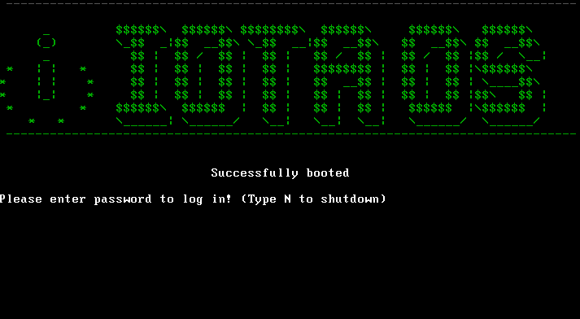

# IOTA OS

It is a command line Operating System built in C# and Cosmos User Kit. It has the following features:

* Elementry Functions
    * Shutdown
    * Reboot
    * Clear
    * Lock Screen
    * Sudo Access
    * Help
    * System Date/Time

* File System Functionalities
    * Change Directory
    * List files and folder under current directory
    * Create Directory
    * Delete Directory
    * Delete File
    * Open file
    * Move File
    * Copy File
    * Concatenate Files
    * Search
    * Current Disk Space
    * Recycle Bin

* Calculator       

* Software Applications
    * Text Editor
    * Snake(Game)

## Getting Started

The .sln file can be opened in Visual Studio and can be used for development purposes.

### Prerequisites

* Visual Studio 2017 with C# and Azure Development Packages
* Cosmos User Kit
* .NET Framework

## Built With

* [Visual Studio 2017](https://visualstudio.microsoft.com/) - The IDE used
* [Cosmos User Kit](https://www.gocosmos.org/) - Dependency Management

## Author

* **Aneesh Dua**

## Acknowledgments

* bartashevich(Snake Game)
* CasteSoftworks(Development Reference)
